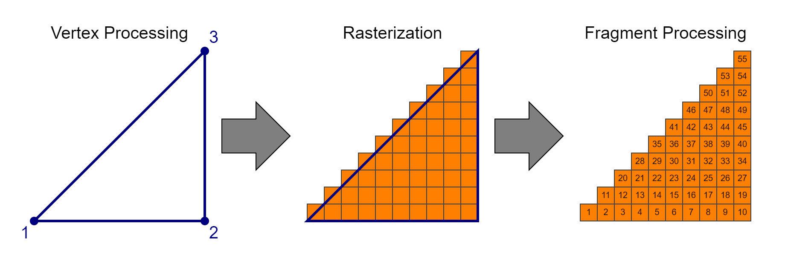
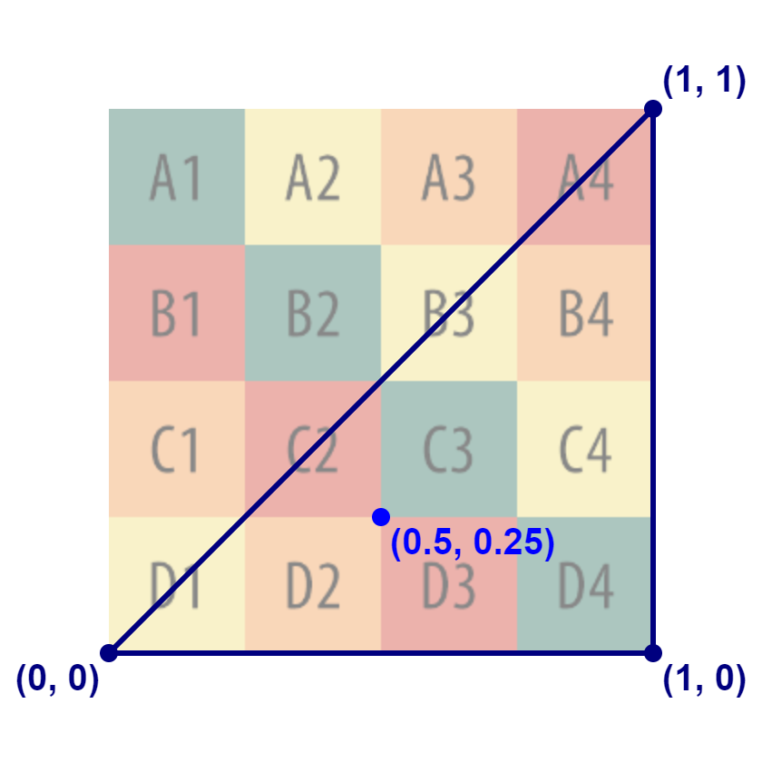

# GLSL Shader

[Live example](https://roomle.github.io/dev-talk-shader-webgl2/dist/client/)

## Rendering pipeline

[Rendering Pipeline Overview](https://www.khronos.org/opengl/wiki/Rendering_Pipeline_Overview) ([Early Fragment Test](https://www.khronos.org/opengl/wiki/Early_Fragment_Test)):

- Vertex Specification
- Vertex Processing (programmable)
- Vertex Post-Processing
- Primitive Assembly
- Rasterization
- Early Fragment Test (e.g. early depth test; partially programmable)
- Fragment Processing (programmable)
- Per-Sample Operations (e.g.: blending, depth test; partially programmable)

Some stages of the rendering pipeline are programmable. A shader program implements the programmable stages of the rendering pipeline.

## Shader program

[Shader](https://www.khronos.org/opengl/wiki/Shader)

A WenGL shader is implemented in GLSL (OpenGL Shading Language). It must be compiled and linked at runtime and is executed on the GPU.  
The shader program consists of a vertex shader and a fragment shader. The vertex shader is executed once per vertex and the fragment shader at least once (multisample anti-aliasing) per fragment.

The GPU can process very many vertices and fragments in parallel (e.g. GeForce RTX 4090 has 16384 FP32 ALUs), that's why it is so fast in image processing and much faster than the CPU.

The input of a shader program are the vertices and vertex attributes of a mesh. The output of the shader program are the fragment colors, which are processed by the Pro-Sample operation and typically written to the frame buffer.

### Vertex shader

[Vertex Shader](https://www.khronos.org/opengl/wiki/Vertex_Shader)

The purpose of the vertex shader is to calculate the clip space position of the vertex.
The input of the vertex shader is the vertex attributes of the mesh.
The output of the vertex shader is the clip space position of the vertex and the programmable outputs that are passed to the next shader stage.

### Fragment shader

[Fragment Shader](https://www.khronos.org/opengl/wiki/Fragment_Shader)

The purpose of the fragment shader is to calculate the fragment color.
The input of the fragment shader are the outputs of the vertex shader.
The output of the fragment shader is the fragment color.

### Shader stage interface

The outputs of the vertex shader are interpolated over the primitive (triangle). The interpolated value is the input for the fragment shader.

## Model, View, Projection

The projection, view and model matrix interact together to present the objects (meshes) of a scene on the viewport.
The model matrix defines the position orientation and scale of a single object (mesh) in the world space of the scene.
The view matrix defines the position and viewing direction of the observer (viewer) within the scene.
The projection matrix defines the area (volume) with respect to the observer (viewer) which is projected onto the viewport.

In perspective projection the viewing volume is a [frustum](https://en.wikipedia.org/wiki/Viewing_frustum) (a truncated pyramid), where the top of the pyramid is the viewing position. The geometry is projected onto the viewport along the ray running through the camera position. This causes that the scene looks like, as it would be seen from of a pinhole camera.
The direction of view (line of sight) and the near and the far distance define the planes which truncated the pyramid to a frustum (the direction of view is the normal vector of this planes).
The viewing frustum is limited by the near and far plane. The geometry is clipped at the 6 planes of the frustum.

[OpenGL Projection Matrix](http://www.songho.ca/opengl/gl_projectionmatrix.html)

